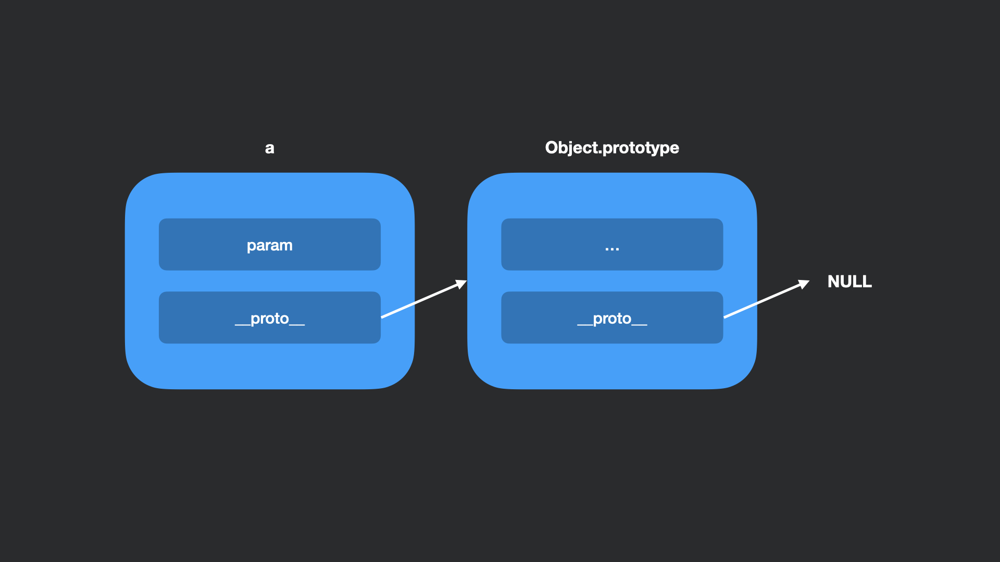

## Прототип

> Прототип — это объект-делегат, используемый для реализации прототипного наследования.
> 
> _Dmitry Soshnikov, JavaScript. Ядро: 2-ое издание_

Каждому объекту присваивается прототип. Если он не задан вручную, то в качестве прототипа указывается **Object.prototype**. Прототип **Object.prototype** же установлен в `null`.

```js
const a = {
    param: 1,
}

console.log(a.__proto__)
```



В итоге формируется цепочка прототипов. При обращении к свойству объекта, сначала происходит поиск в текущем объекте, затем в прототипе текущего объекта и так до тех пор, пока не будет найдено нужное свойство в одном из прототипов. Если же мы пройдем всю цепочку, не найдя нужного свойства, то вернется `undefined`.

Значение текущего прототипа объекта хранится в `__proto__`.

Такой подход к разрешению свойств называется *также называется динамической диспетчеризацией*.

### Дополнительно
- [JavaScript. Ядро: 2-ое издание](http://dmitrysoshnikov.com/ecmascript/javascript-the-core-2nd-edition-rus/#prototip),
- [Прототипное наследование](https://learn.javascript.ru/prototype-inheritance),
- [Наследование и цепочка прототипов](https://developer.mozilla.org/ru/docs/Web/JavaScript/Inheritance_and_the_prototype_chain).
