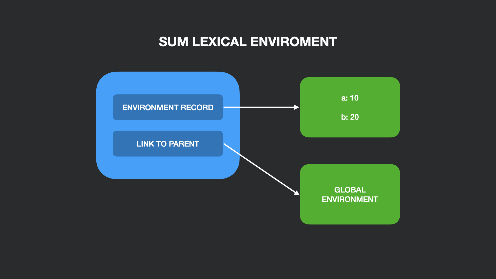

## Что такое лексическое окружение?

> Лексическое окружение — это структура, используемая для ассоциации идентификаторов, появляющихся в контексте, с их значениями. Каждое лексическое окружение также может иметь ссылку на родительское окружение.
> 
> _Dmitry Soshnikov, JavaScript. Ядро: 2-ое издание_

Когда мы выполняем код, для текущего контекста исполнения создается свое лексическое окружение. По сути это хранилище, которое состоит из списка переменных, объявленных в текущем контексте исполнения и ссылке на внешнее родительское окружение (может быть _null_).

```js
function sum() {
    const a = 10; // добавяем a в запись окружения (environment record) 
    const b = 20; // добавляем b в запись окружения
    return a + b;
}

sum();
```



Если мы обратимся к определенной переменной, то будет произведен поиск по всей цепочке окружений, начиная от текущего и дальше по родительским, пока не будет найдена эта переменная, либо указатель на следующее окружение не будет равен _null_.

Глобальное окружение — это лексическое окружение без ссылки на родительское внешнее окружение. В нем находятся глобальные переменные, объявленные пользователем, и сущности, встроенные в язык (Object, Array и т.д.). 

### Дополнительно
- [JavaScript. Ядро: 2-ое издание](http://dmitrysoshnikov.com/ecmascript/javascript-the-core-2nd-edition-rus/#leksicheskoe-okrujenie),
- [Контекст выполнения и стек вызовов в JavaScript](https://habr.com/ru/company/ruvds/blog/422089/).
