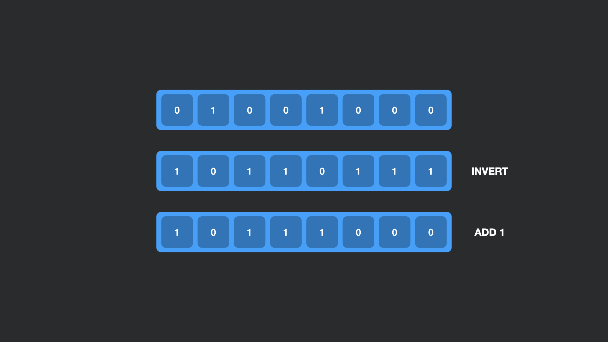
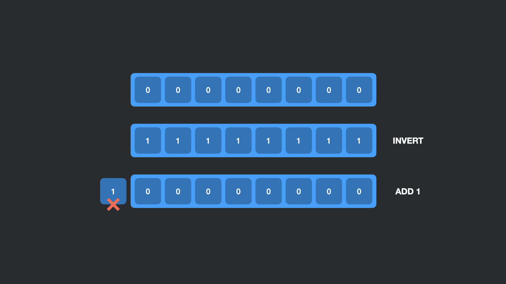

## Дополнительный код

Целочисленные типы данных представлены в Java в виде двоичных чисел.
Например: для типа `byte` число `72` представлено двоичным числом `01001000`.

Отрицательные числа преобразуются из положительных путем инвертирования всех битов числа и добавления `1` к числу.

Например, чтобы получить `-72` необходимо взять двоичное представление `72`, инвертировать все биты и прибавить `1`.:

Причины добавления `1` просты. Все дело в `0`, двоичный код которого в `byte` будет `00000000`. 
Если мы просто инвертируем `00000000`, то получим `11111111`. Но в математики не может быть отрицательного значения `0`.
Прибавляя `1` мы заходим за пределы типа `byte` и наша единица откидывается.

В итоге отсутствует отрицательный ноль.

Рассмотрим пример:

