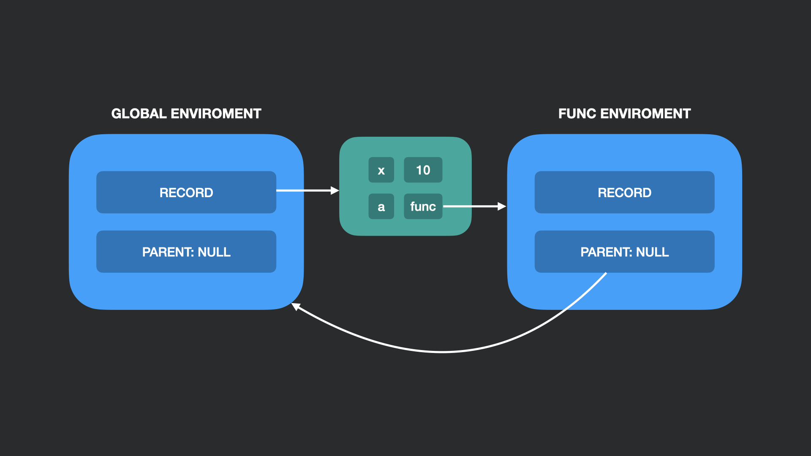

## Функция первого класса

> Замыкание — это функция, захватывающая лексическое окружение того контекста, где она создана. В дальнейшем это окружение используется для разрешения идентификаторов
> 
> _Dmitry Soshnikov, JavaScript. Ядро: 2-ое издание_

Как уже было замечено, замыкание захватывает лексическое окружение порождающего контекста. Важно заметить, что даже если порождающий контекст удаляется, то лексическое окружение этого контекста будет сохранено.
По сути мы получим хранилище с переменными.

Приведем пример с захватом глобального окружения:

```js
let x = 10;

function a() { // функция 'a' захватывает глобальное окружение
    console.log(x);
}
```



Пример с захватом окружения порождающей функции:

```js
function parent() {
    let x = 10;

    function inc() { // функция 'inc' захватывает окружение функции parent
        x++;
        return x;
    }

    function dec() { // функция 'dev' захватывает окружение функции parent
        x--;
        return x;
    }
    
    return {
        inc,
        dec
    }
}

const { inc, dec } = parent();

console.log(inc()); // вывод: 11
console.log(inc()); // вывод: 12
console.log(dec()); // вывод: 11
```

В данном случае функциями `inc` и `dec` будет захвачено окружение функции `parent`. Важно, что `inc` и `dec` ссылаются на одно и то же окружение.

### Дополнительно
- [JavaScript. Ядро: 2-ое издание](http://dmitrysoshnikov.com/ecmascript/javascript-the-core-2nd-edition-rus/#zamyikanie),
- [Тонкости ECMA-262-3. Часть 6. Замыкания](http://dmitrysoshnikov.com/ecmascript/ru-chapter-6-closures/#zamyikanie),
- [Замыкание на learn.javascript](https://learn.javascript.ru/closure),
- [Замыкание на MDN](https://developer.mozilla.org/ru/docs/Web/JavaScript/Closures).
