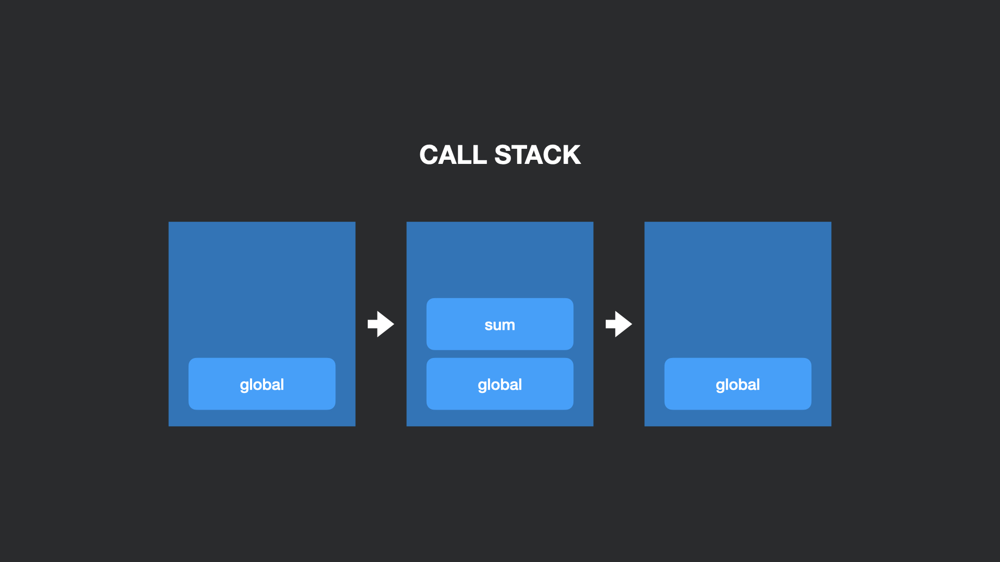

## Контекст исполнения

> Контекст исполнения — это абстрактное понятие, используемое спецификацией ECMAScript для типизации и разграничения исполняемого кода.
> 
> _Dmitry Soshnikov, JavaScript. Ядро: 2-ое издание_

Контекст исполнения — это концепция окружения, в котором вызывается наш код. 

Существует три типа контекстов исполнения:
- Глобальный контекст — кода мы запускаем код вне функций, модулей и eval, он находится в глобальном контексте;
- Контекст функции — каждый вызов функции создает новый контекст выполнения;
- Контекст eval — при выполнении кода в eval создается новый контекст выполнения;
- Контекст модуля — аналогичное поведение.

При выполнении кода, контекст в котором он находится, называют _активным контекстом_.
Этот контекст добавляется в стек контекстов исполнения на момент старта выполнения кода и удаляется оттуда в конце.
Например, при вызове функции происходи push в стек, а при возврате из функции происходит pop из стека.

> Стек контекстов исполнения — это LIFO структура.

```js
function sum(a, b) {
    return a + b;
}

const result = sum(1, 2); // push в стек при вызове, pop при возврате из функции
```



При создании контекста исполнения происходят следующие действия:
1. Привязка this,
2. Создание лексического окружения,
3. Создание окружения переменных.

### Дополнительно
- [JavaScript. Ядро: 2-ое издание](http://dmitrysoshnikov.com/ecmascript/javascript-the-core-2nd-edition-rus/#kontekst-ispolneniya),
- [Контекст выполнения и стек вызовов в JavaScript](https://habr.com/ru/company/ruvds/blog/422089/).
