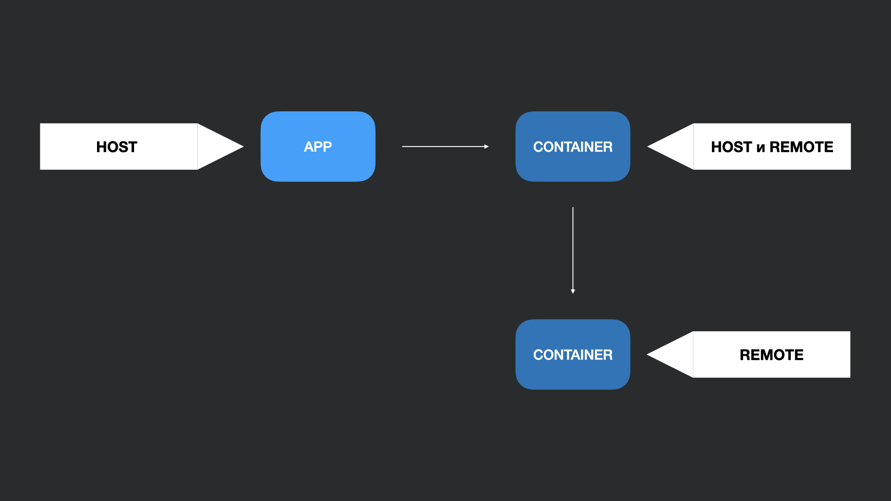
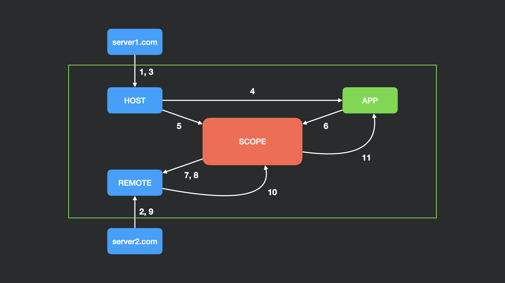

## Терминология

- Host (consumer) - bundle, который первый инициализировался во время загрузки страницы (root);
- Remote (consumable) – другой bundle, чьи части может импортировать host (leaf);
- Omnidirectional host – bundle, который одновременно может быть и host, и remote (внутренний node);
- Exposed Modules - модули, которые будут доступны другим микрофронтендам;
- Shared Modules - модули, которые могут общими для нескольких микрофронтендов (react, redux).

## Процессы внутри Module Federation 

1. Первым делом подключается основная webpack-сборка;
2. И параллельно происходи подключение remoteEntry.js - логики с Remote;
3. Подгрузка chunk'ов для App;
4. Подгрузка chunk'ов происходит асинхронно;
5. Добавление в scope react определенной версии;
6. App запрашивает определенный **компонент** у scope;
7. Scope отслеживает общие модули и предоставляет информацию о них для Remote. В нашем случае это React. Remote решает нужно ли ему использовать текущую версию или грузить другую версию;
8. Scope запрашивает нужный **компонент** у Remote; 
9. Подгружает chunk'и (не общие), которые нужны для данного **компонента**; 
10. Асинхронно отдает нужный **компонент** в scope;
11. Асинхронно отдаем нужный **компонент** в App.
   
Scope - это по сути прокси объект для Remote, с помощью которого мы асинхронно получаем доступ к модулям.

## Как устроен под капотом

> Раздел в процессе

## Проблемы с Module Federation

- Как решить проблему версионирования и нарушение контракта;
- Как правильно организовать роутинг;
- Как решать проблемы с сетью;
- Нет четкого гайда о том, как организовать взаимодействие между микрофронтендами;
- Как организовать изоляцию стилей;
- Как организовать тестирование, если меняется контракт;
- Сложность с SSR.

### Дополнительно
- [Павел Черторогов — Революция в микрофронтендах, module federation, Webpack 5](https://youtu.be/pcY8-pDGLkI),
- [Module Federation in Webpack 5 - Tobias Koppers](https://youtu.be/gmUm7CTsNhk) и [слайды](https://github.com/sokra/slides/blob/master/content/ModuleFederationWebpack5.md?utm_source=pocket_mylist),
- [Webpack 5 Module Federation - A look at the source code and how it works](https://www.youtube.com/watch?v=HDRIvks0yyk).